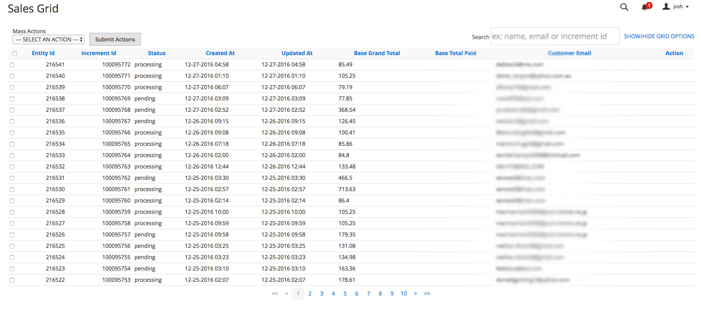
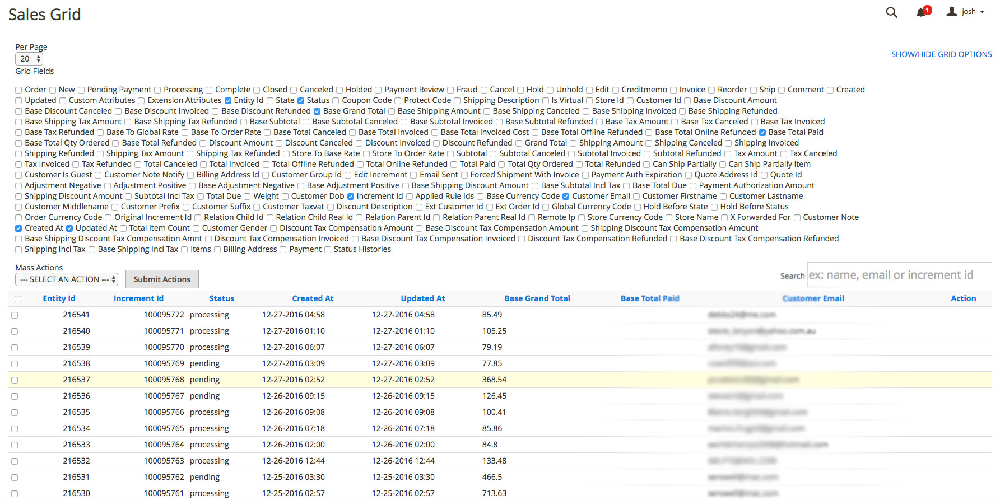

# Magento 2 Sales/Order grid

## This grid was made to fix the XML bug / limitation on magento 2.
- https://github.com/magento/magento2/issues/8084





## Tech
- Backbone
- Backgrid
- Moment
- Underscore
- Require JS
- Magento 2

## Install from CLI
``` 
cd /path/to/site??????????
composer config repositories.salesgrid path vcs https://github.com/joshspivey/magento2-sales-grid.git 
composer require JoshSpivey/mage2-sales-grid
php -f bin/magento setup:upgrade
php bin/magento setup:di:compile
sudo php bin/magento setup:static-content:deploy && sudo php bin/magento indexer:reindex && sudo php bin/magento cache:clean && sudo php bin/magento cache:flush
```

## Install from setup
- You actually use that? It doesnt work...

## To Do
- Add in all types for orders on client side script.
- Add in admin page to dynamically add columns based on order data.
- Add in ability to change record QTY per page.
- Add in actions.
- Add in multi select for actions.
- Activate CRUD on data in client grid and add CRUD to controller.

## Please Contribute if you want to add any of this functionality I will merge to master. 
